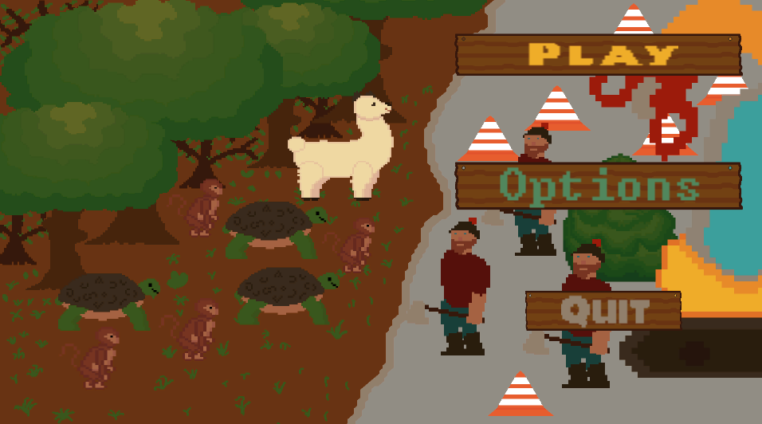
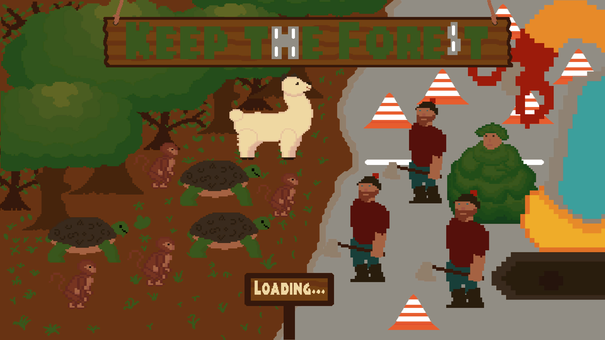
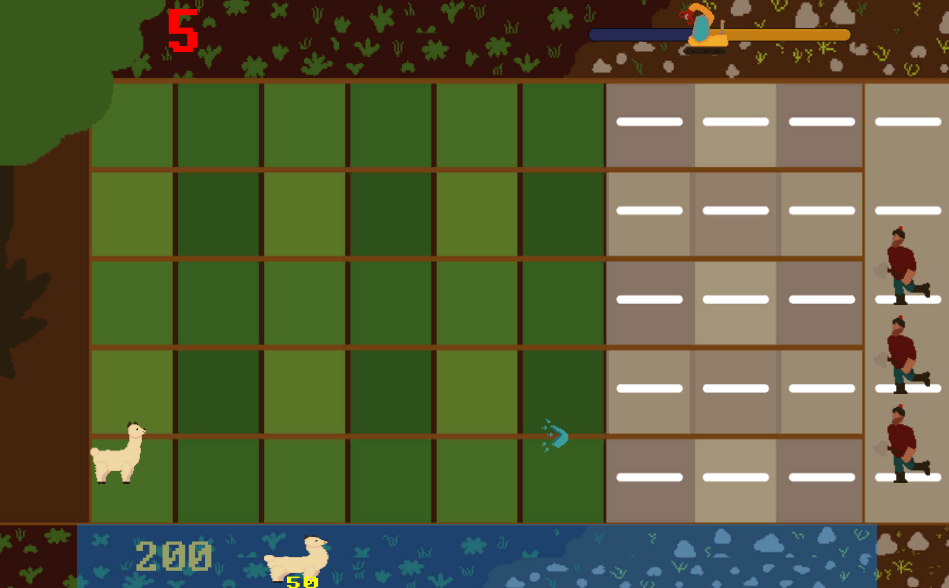

# Keep the forest

Keep the forest - home of the animals, which is targeted by the humans, so they could erect a new building.
The font is Green Screen, created by [James Shields](https://www.dafont.com/james-shields.d183).
It can be found here - https://www.dafont.com/green-screen.font.
The sounds are made in Bosca Ceoil.
Tested on Debian and Windows.
Hosted on [my website](https://ivaylolivanov.github.io/projects.html) and [itch.io](https://m00ns7ruck.itch.io/keep-the-forest).

# Screenshots

